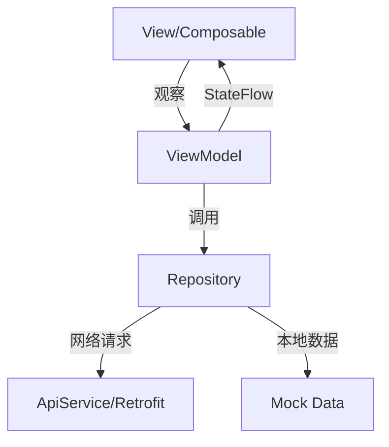
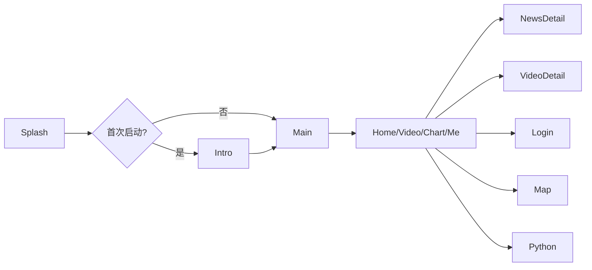

# AndroidEndProject_Compose 项目文档

> **版本**: 1.0  
> **更新日期**: 2024-12-14  
> **技术栈**: Kotlin + Jetpack Compose + MVVM + Koin + Firebase

---

## 目录

1. [项目概述](#1-项目概述)
2. [技术架构](#2-技术架构)
3. [依赖版本清单](#3-依赖版本清单)
4. [项目结构](#4-项目结构)
5. [数据层详解](#5-数据层详解)
6. [UI层详解](#6-ui层详解)
7. [导航架构](#7-导航架构)
8. [功能模块详解](#8-功能模块详解)
9. [构建配置](#9-构建配置)

---

## 1. 项目概述

### 1.1 应用简介

本项目是一个基于 **Jetpack Compose** 的 Android 应用，采用现代化的 MVVM 架构模式。应用功能包括：

- **首页**: Banner 轮播、分类按钮、新闻列表
- **视频**: 视频列表、视频详情播放、全屏模式
- **图表**: 折线图、柱状图、饼图展示
- **个人中心**: 登录/注册、用户信息、地图功能
- **Python 课程**: 课程列表展示

### 1.2 技术特点

| 特点 | 描述 |
|------|------|
| **纯 Compose UI** | 100% 使用 Jetpack Compose 构建界面 |
| **响应式编程** | 采用 Kotlin Flow + StateFlow |
| **依赖注入** | Koin 框架管理依赖 |
| **网络层** | Retrofit + OkHttp |
| **认证服务** | Firebase Authentication |
| **数据存储** | Firebase Firestore |
| **视频播放** | Media3 ExoPlayer |
| **地图服务** | 百度地图 SDK |

---

## 2. 技术架构

### 2.1 MVVM 架构



### 2.2 分层结构

| 层级 | 职责 | 关键类 |
|------|------|--------|
| **UI 层** | 界面展示、用户交互 | `*Screen.kt`, `*ViewModel.kt` |
| **数据层** | 数据获取与缓存 | `*Repository.kt`, `ApiService.kt` |
| **领域层** | 业务逻辑封装 | 数据模型 `*Model.kt` |
| **DI 层** | 依赖注入配置 | `AppModule.kt` |

---

## 3. 依赖版本清单

### 3.1 核心依赖

| 分类 | 依赖名称 | 版本号 |
|------|----------|--------|
| **Android Gradle Plugin** | `com.android.application` | `8.13.2` |
| **Kotlin** | `org.jetbrains.kotlin.android` | `2.2.21` |
| **AndroidX Core** | `core-ktx` | `1.17.0` |
| **Splash Screen** | `core-splashscreen` | `1.2.0` |

### 3.2 Jetpack Compose

| 依赖名称 | 版本号 (BOM 管理) |
|----------|-------------------|
| **Compose BOM** | `2025.12.00` |
| `compose-ui` | BOM 管理 |
| `compose-ui-graphics` | BOM 管理 |
| `compose-material3` | BOM 管理 |
| `compose-material-icons-extended` | BOM 管理 |
| `compose-foundation` | BOM 管理 |

### 3.3 Lifecycle & Navigation

| 依赖名称 | 版本号 |
|----------|--------|
| **Lifecycle** (runtime/viewmodel) | `2.10.0` |
| **Navigation Compose** | `2.9.6` |
| **Activity Compose** | `1.12.1` |

### 3.4 协程

| 依赖名称 | 版本号 |
|----------|--------|
| `kotlinx-coroutines-core` | `1.10.2` |
| `kotlinx-coroutines-android` | `1.10.2` |
| `kotlinx-coroutines-play-services` | `1.10.2` |

### 3.5 依赖注入

| 依赖名称 | 版本号 |
|----------|--------|
| **Koin BOM** | `4.1.1` |
| `koin-android` | BOM 管理 |
| `koin-core` | BOM 管理 |
| `koin-compose` | BOM 管理 |

### 3.6 网络层

| 依赖名称 | 版本号 |
|----------|--------|
| **Retrofit** | `3.0.0` |
| **OkHttp** | `5.3.2` |
| **Gson** | `2.13.2` |

### 3.7 图片加载

| 依赖名称 | 版本号 |
|----------|--------|
| **Coil Compose** | `3.3.0` |
| **Coil Network OkHttp** | `3.3.0` |

### 3.8 Firebase

| 依赖名称 | 版本号 |
|----------|--------|
| **Firebase BOM** | `34.7.0` |
| `firebase-auth` | BOM 管理 |
| `firebase-firestore` | BOM 管理 |
| **Google Services** | `4.4.4` |

### 3.9 其他依赖

| 分类 | 依赖名称 | 版本号 |
|------|----------|--------|
| **Accompanist** | Pager/Indicators/SystemUI | `0.36.0` |
| **图表** | `compose-charts` | `0.2.1` |
| **视频** | Media3 ExoPlayer | `1.8.0` |
| **地图** | 百度地图 SDK | `7.6.6` |

---

## 4. 项目结构

### 4.1 完整目录树

```
app/src/main/java/ovo/sypw/androidendproject/
├── MyApplication.kt              # Application 入口，初始化 Koin
├── data/                         # 数据层
│   ├── model/                    # 数据模型
│   │   ├── Banner.kt             # 轮播图数据
│   │   ├── ChartData.kt          # 图表数据 (Line/Bar/Pie)
│   │   ├── News.kt               # 新闻数据
│   │   ├── PythonCourse.kt       # Python 课程数据
│   │   ├── User.kt               # 用户数据
│   │   └── Video.kt              # 视频数据 + VideoDetail
│   ├── remote/                   # 网络层
│   │   ├── ApiService.kt         # Retrofit API 接口
│   │   ├── RetrofitClient.kt     # Retrofit 客户端配置
│   │   └── ApiResponse.kt        # API 响应封装
│   └── repository/               # 数据仓库
│       ├── NewsRepository.kt     # 新闻数据仓库
│       ├── VideoRepository.kt    # 视频数据仓库
│       ├── UserRepository.kt     # 用户数据仓库 (Firebase)
│       └── ChartRepository.kt    # 图表数据仓库
├── di/                           # 依赖注入
│   └── AppModule.kt              # Koin 模块定义
├── ui/                           # UI 层
│   ├── MainActivity.kt           # 主 Activity
│   ├── components/               # 可复用组件
│   │   ├── BannerCarousel.kt     # Banner 轮播组件
│   │   ├── CategoryButtonRow.kt  # 分类按钮组件
│   │   ├── ChartViews.kt         # 图表组件
│   │   ├── ErrorView.kt          # 错误视图组件
│   │   ├── LoadingIndicator.kt   # 加载指示器
│   │   ├── NewsItem.kt           # 新闻列表项
│   │   ├── SpeedDialFab.kt       # 展开式 FAB
│   │   └── VideoItem.kt          # 视频列表项
│   ├── navigation/               # 导航配置
│   │   ├── Screen.kt             # 路由定义
│   │   └── NavGraph.kt           # 导航图
│   ├── screens/                  # 屏幕页面
│   │   ├── splash/               # 启动页
│   │   ├── intro/                # 引导页
│   │   ├── main/                 # 主页面 (底部导航)
│   │   ├── home/                 # 首页
│   │   ├── video/                # 视频模块
│   │   ├── chart/                # 图表模块
│   │   ├── me/                   # 个人中心
│   │   ├── login/                # 登录注册
│   │   ├── map/                  # 地图页
│   │   ├── news/                 # 新闻详情
│   │   └── python/               # Python 课程
│   └── theme/                    # 主题配置
│       ├── Color.kt
│       ├── Theme.kt
│       └── Type.kt
└── utils/                        # 工具类
```

### 4.2 文件统计

| 目录 | 文件数 | 说明 |
|------|--------|------|
| `data/model` | 6 | 数据模型定义 |
| `data/remote` | 3 | 网络请求相关 |
| `data/repository` | 4 | 数据仓库 |
| `ui/components` | 8 | 可复用 UI 组件 |
| `ui/screens` | 11 模块 | 各功能屏幕 |
| `ui/navigation` | 2 | 导航配置 |

---

## 5. 数据层详解

### 5.1 数据模型

#### Banner.kt
```kotlin
data class Banner(
    val id: String,
    val imageUrl: String,
    val title: String,
    val linkUrl: String
)
```

#### News.kt
```kotlin
data class News(
    val id: String,
    val title: String,
    val summary: String,
    val imageUrl: String,
    val sourceUrl: String,
    val publishTime: String,
    val type: Int  // 1=单图, 2=三图
)
```

#### Video.kt
```kotlin
data class Video(
    val id: String,
    val name: String,
    val coverUrl: String,
    val intro: String,
    val videoDetailList: List<VideoDetail>
)

data class VideoDetail(
    val videoId: String,
    val videoName: String,
    val videoUrl: String
)
```

#### ChartData.kt
```kotlin
data class LineChartData(title: String, description: String, labels: List<String>, values: List<Float>)
data class BarChartData(title: String, description: String, labels: List<String>, series: List<BarSeries>)
data class PieChartData(title: String, description: String, items: List<PieChartItem>)
data class PieChartItem(label: String, value: Float, color: Color)
```

#### User.kt
```kotlin
data class User(
    val uid: String,
    val email: String,
    val displayName: String?,
    val avatarUrl: String?
)
```

#### PythonCourse.kt
```kotlin
data class PythonCourse(
    val id: Int,
    val address: String,
    val content: String,
    val openClass: String
)
```

### 5.2 Repository 模式

每个 Repository 负责从 API 或 Mock 数据获取数据，并通过 Flow 暴露给 ViewModel：

```kotlin
class NewsRepository(private val apiService: ApiService) {
    fun getNewsList(page: Int, pageSize: Int): Flow<Result<NewsListData>> = flow {
        try {
            val response = apiService.getNewsList(page, pageSize)
            emit(Result.success(response.data))
        } catch (e: Exception) {
            emit(Result.success(getMockData()))
        }
    }
}
```

### 5.3 网络层

#### RetrofitClient.kt 配置
```kotlin
object RetrofitClient {
    private const val BASE_URL = "https://api.example.com/"
    
    val okHttpClient = OkHttpClient.Builder()
        .connectTimeout(30, TimeUnit.SECONDS)
        .addInterceptor(HttpLoggingInterceptor())
        .build()
    
    val retrofit = Retrofit.Builder()
        .baseUrl(BASE_URL)
        .client(okHttpClient)
        .addConverterFactory(GsonConverterFactory.create())
        .build()
}
```

---

## 6. UI层详解

### 6.1 可复用组件

| 组件 | 文件 | 功能描述 |
|------|------|----------|
| **BannerCarousel** | `BannerCarousel.kt` | 首页轮播图，支持自动滚动、手势滑动、指示器 |
| **CategoryButtonRow** | `CategoryButtonRow.kt` | 分类按钮行 (Android/Java/PHP/Python)，带图标和背景色 |
| **NewsItem** | `NewsItem.kt` | 新闻列表项，支持单图和三图两种布局 |
| **VideoItem** | `VideoItem.kt` | 视频列表项，显示封面、标题、简介、视频数量 |
| **SpeedDialFab** | `SpeedDialFab.kt` | 展开式 FAB，用于图表类型切换 |
| **ChartViews** | `ChartViews.kt` | 折线图、柱状图、饼图组件 |
| **LoadingIndicator** | `LoadingIndicator.kt` | 加载指示器 |
| **ErrorView** | `ErrorView.kt` | 错误提示视图，带重试按钮 |

### 6.2 屏幕组件架构

#### HomeScreen 结构
```
HomeScreen
├── PullToRefreshBox (下拉刷新)
│   └── LazyColumn
│       ├── BannerCarousel (轮播图)
│       ├── CategoryButtonRow (分类按钮)
│       └── NewsItem[] (新闻列表)
```

#### ChartScreen 结构
```
ChartScreen
├── Scaffold
│   ├── TopAppBar (标题)
│   ├── Content
│   │   ├── LineChart / BarChart / PieChart (根据选择)
│   │   └── ChartLegend (图例)
│   └── SpeedDialFab (图表切换 FAB)
```

#### VideoDetailScreen 结构
```
VideoDetailScreen
├── Scaffold
│   ├── TopAppBar (视频标题)
│   └── Column
│       ├── VideoPlayer (视频播放器，支持全屏)
│       ├── PrimaryTabRow (简介/列表)
│       └── TabContent
│           ├── VideoIntroContent (视频简介)
│           └── VideoListContent (视频列表)
```

#### MeScreen 结构
```
MeScreen
├── Column
│   ├── 用户头像 + 名称
│   ├── LoggedInContent / NotLoggedInContent
│   └── MeMenuItem[] (菜单项)
```

---

## 7. 导航架构

### 7.1 路由定义 (Screen.kt)

```kotlin
sealed class Screen(val route: String) {
    data object Splash : Screen("splash")
    data object Intro : Screen("intro")
    data object Main : Screen("main")
    data object Home : Screen("home")
    data object Video : Screen("video")
    data object Chart : Screen("chart")
    data object Me : Screen("me")
    data object Login : Screen("login")
    data object Map : Screen("map")
    data object Python : Screen("python")
    
    data object NewsDetail : Screen("news_detail/{url}/{title}") {
        fun createRoute(url: String, title: String): String
    }
    
    data object VideoDetail : Screen("video_detail/{videoId}") {
        fun createRoute(videoId: String): String
    }
}
```

### 7.2 导航流程图



### 7.3 底部导航

| Tab | 路由 | 图标 | 页面 |
|-----|------|------|------|
| 首页 | `home` | Home | HomeScreen |
| 图表 | `chart` | BarChart | ChartScreen |
| 视频 | `video` | PlayCircle | VideoScreen |
| 我的 | `me` | Person | MeScreen |

---

## 8. 功能模块详解

### 8.1 首页模块 (Home)

#### 功能列表
- ✅ Banner 轮播图 (自动滚动)
- ✅ 分类按钮 (Android/Java/PHP/Python)
- ✅ 新闻列表 (下拉刷新 + 加载更多)
- ✅ 点击新闻跳转详情 (WebView)
- ✅ 点击 Python 跳转课程页

#### 关键代码
```kotlin
@Composable
fun HomeScreen(
    viewModel: HomeViewModel = koinViewModel(),
    onNewsClick: (News) -> Unit,
    onBannerClick: (Banner) -> Unit,
    onCategoryClick: (String) -> Unit
)
```

### 8.2 视频模块 (Video)

#### 功能列表
- ✅ 视频列表展示
- ✅ 视频详情页 (TabLayout: 简介/列表)
- ✅ ExoPlayer 视频播放
- ✅ 全屏播放 (横屏)
- ✅ 设备旋转自动全屏
- ✅ 播放列表切换

#### 全屏逻辑
```kotlin
// AndroidManifest.xml 配置
android:configChanges="orientation|screenSize|screenLayout|smallestScreenSize"

// 全屏切换
if (isFullscreen) {
    activity?.requestedOrientation = SCREEN_ORIENTATION_SENSOR_LANDSCAPE
    hideSystemUI()
} else {
    activity?.requestedOrientation = SCREEN_ORIENTATION_PORTRAIT
    showSystemUI()
}
```

### 8.3 图表模块 (Chart)

#### 功能列表
- ✅ 折线图 (年度薪资走势)
- ✅ 柱状图 (Java/PHP 工资对比)
- ✅ 饼图 (Android 工程师薪资占比)
- ✅ SpeedDial FAB 切换图表类型
- ✅ 饼图点击交互 (高亮 + 中心文字更新)

#### 图表数据示例
```kotlin
PieChartData.mock() = PieChartData(
    title = "Android工程师薪资占比",
    items = listOf(
        PieChartItem("8-15k", 25f, Color.Gray),
        PieChartItem("15-30k", 45f, Color.Magenta),
        PieChartItem("30-100k", 25f, Color.Green),
        PieChartItem("100k+", 5f, Color.Blue)
    )
)
```

### 8.4 个人中心 (Me)

#### 功能列表
- ✅ 登录/未登录状态区分
- ✅ 用户头像 + 名称显示
- ✅ 登录/注册功能 (Firebase Auth)
- ✅ 退出登录
- ✅ 地图入口

#### 用户状态管理
```kotlin
sealed class MeUiState {
    data object Loading : MeUiState()
    data class LoggedIn(val user: User) : MeUiState()
    data object NotLoggedIn : MeUiState()
}
```

### 8.5 登录模块 (Login)

#### 功能列表
- ✅ 用户名 + 密码登录
- ✅ 注册账号
- ✅ 登录/注册模式切换
- ✅ 找回密码入口 (占位)
- ✅ Firebase Authentication 集成

### 8.6 地图模块 (Map)

#### 功能列表
- ✅ 百度地图集成
- ✅ 地图显示
- ✅ POI 搜索 (关键词搜索附近 10km)
- ✅ 快捷分类搜索 (餐厅/酒店/银行/医院/超市/加油站/停车场)
- ✅ 标记点展示 (在地图上显示搜索结果)
- ✅ POI 详情卡片 (名称/地址/电话)
- ✅ 定位按钮 (回到当前位置)

### 8.7 Python 课程 (Python)

#### 功能列表
- ✅ 课程列表展示
- ✅ 地址 + 课程内容 + 报名按钮
- ✅ 已报满状态禁用

---

## 9. 构建配置

### 9.1 SDK 版本

| 配置项 | 值 |
|--------|-----|
| `compileSdk` | 36 |
| `minSdk` | 35 |
| `targetSdk` | 36 |
| `jvmTarget` | 17 |

### 9.2 Gradle 插件

```kotlin
plugins {
    alias(libs.plugins.android.application)
    alias(libs.plugins.kotlin.android)
    alias(libs.plugins.kotlin.compose)
    alias(libs.plugins.google.services)
}
```

### 9.3 ProGuard 配置

```
release {
    isMinifyEnabled = false
    proguardFiles(
        getDefaultProguardFile("proguard-android-optimize.txt"),
        "proguard-rules.pro"
    )
}
```

### 9.4 AndroidManifest 关键配置

```xml
<!-- 权限 -->
<uses-permission android:name="android.permission.INTERNET" />
<uses-permission android:name="android.permission.ACCESS_NETWORK_STATE" />
<uses-permission android:name="android.permission.ACCESS_FINE_LOCATION" />
<uses-permission android:name="android.permission.ACCESS_COARSE_LOCATION" />

<!-- Activity 配置 -->
<activity
    android:name=".ui.MainActivity"
    android:configChanges="orientation|screenSize|screenLayout|smallestScreenSize"
    android:theme="@style/Theme.AndroidEndProject_Compose">
```

---

## 附录

### A. Koin 模块配置

```kotlin
val appModule = module { }

val networkModule = module {
    single { RetrofitClient.okHttpClient }
    single { RetrofitClient.retrofit }
    single { RetrofitClient.retrofit.create(ApiService::class.java) }
}

val repositoryModule = module {
    single { NewsRepository(get()) }
    single { VideoRepository(get()) }
    single { UserRepository() }
    single { ChartRepository() }
}

val viewModelModule = module {
    viewModelOf(::HomeViewModel)
    viewModelOf(::VideoViewModel)
    viewModelOf(::ChartViewModel)
    viewModelOf(::MeViewModel)
    viewModelOf(::LoginViewModel)
}
```

### B. 测试视频 URL

```kotlin
val sampleVideoUrls = listOf(
    "https://storage.googleapis.com/exoplayer-test-media-0/BigBuckBunny_320x180.mp4",
    "https://storage.googleapis.com/gtv-videos-bucket/sample/ElephantsDream.mp4",
    "https://storage.googleapis.com/gtv-videos-bucket/sample/Sintel.mp4",
    "https://storage.googleapis.com/gtv-videos-bucket/sample/TearsOfSteel.mp4"
    // ...
)
```

---

**文档结束**
