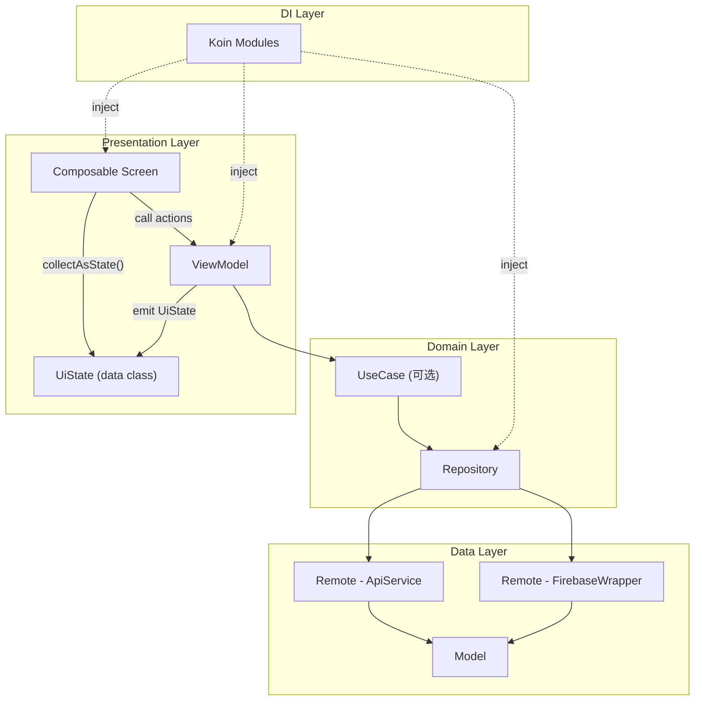

# AndroidEndProject - Compose + Flow + MVVM 架构文档

## 一、项目概述

**项目名称**: AndroidEndProject  
**包名**: `ovo.sypw.androidendproject`  
**应用版本**: 1.0 (versionCode: 1)  
**最低 SDK**: 35 (Android 15)  
**目标 SDK**: 36  
**编译 SDK**: 36  
**Java 版本**: 17  
**Kotlin JVM Target**: 17

本文档描述项目使用 **Jetpack Compose** 作为 UI 框架、**Kotlin Flow** 作为响应式数据流、**MVVM** 作为架构模式的实现方案。

---

## 二、依赖版本详情

### 2.1 Gradle 插件

| 插件 | 版本 |
|------|------|
| Android Gradle Plugin (AGP) | 8.13.1 |
| Kotlin Android Plugin | 2.2.21 |
| Kotlin Compose Compiler Plugin | 2.2.21 |
| Google Services Plugin | 4.4.4 |

### 2.2 Jetpack Compose 依赖

| 依赖 | 版本 | 说明 |
|------|------|------|
| `androidx.compose:compose-bom` | 2024.12.00 | Compose BOM 统一版本管理 |
| `androidx.compose.ui:ui` | BOM 管理 | Compose UI 核心 |
| `androidx.compose.ui:ui-graphics` | BOM 管理 | 图形绘制 |
| `androidx.compose.ui:ui-tooling-preview` | BOM 管理 | 预览支持 |
| `androidx.compose.material3:material3` | BOM 管理 | Material 3 组件 |
| `androidx.compose.material:material-icons-extended` | BOM 管理 | 扩展图标库 |
| `androidx.compose.foundation:foundation` | BOM 管理 | 基础组件 |
| `androidx.compose.runtime:runtime` | BOM 管理 | 运行时 |
| `androidx.activity:activity-compose` | 1.12.1 | Activity 集成 |
| `androidx.lifecycle:lifecycle-runtime-compose` | 2.10.0 | Lifecycle 集成 |
| `androidx.lifecycle:lifecycle-viewmodel-compose` | 2.10.0 | ViewModel 集成 |
| `androidx.navigation:navigation-compose` | 2.9.6 | Compose 导航 |

### 2.3 AndroidX 核心库

| 依赖 | 版本 | 说明 |
|------|------|------|
| `androidx.core:core-ktx` | 1.17.0 | Kotlin 扩展核心库 |
| `androidx.core:core-splashscreen` | 1.2.0 | 启动画面 |

### 2.4 Lifecycle

| 依赖 | 版本 |
|------|------|
| `androidx.lifecycle:lifecycle-viewmodel-ktx` | 2.10.0 |
| `androidx.lifecycle:lifecycle-runtime-ktx` | 2.10.0 |

### 2.5 Kotlin Coroutines

| 依赖 | 版本 |
|------|------|
| `org.jetbrains.kotlinx:kotlinx-coroutines-core` | 1.10.2 |
| `org.jetbrains.kotlinx:kotlinx-coroutines-android` | 1.10.2 |
| `org.jetbrains.kotlinx:kotlinx-coroutines-play-services` | 1.10.2 |

### 2.6 依赖注入 - Koin

| 依赖 | 版本 |
|------|------|
| `io.insert-koin:koin-bom` | 4.1.1 |
| `io.insert-koin:koin-android` | BOM 管理 |
| `io.insert-koin:koin-androidx-compose` | BOM 管理 |

### 2.7 网络请求

| 依赖 | 版本 | 说明 |
|------|------|------|
| `com.squareup.retrofit2:retrofit` | 3.0.0 | REST API 客户端 |
| `com.squareup.retrofit2:converter-gson` | 3.0.0 | JSON 转换器 |
| `com.squareup.okhttp3:okhttp` | 5.3.2 | HTTP 客户端 |
| `com.squareup.okhttp3:logging-interceptor` | 5.3.2 | 日志拦截器 |
| `com.google.code.gson:gson` | 2.13.2 | JSON 解析 |

### 2.8 图片加载 - Coil (Compose)

| 依赖 | 版本 |
|------|------|
| `io.coil-kt.coil3:coil-compose` | 3.3.0 |
| `io.coil-kt.coil3:coil-network-okhttp` | 3.3.0 |

### 2.9 Firebase 服务

| 依赖 | 版本 |
|------|------|
| `com.google.firebase:firebase-bom` | 34.6.0 |
| `com.google.firebase:firebase-auth` | BOM 管理 |
| `com.google.firebase:firebase-firestore` | BOM 管理 |

### 2.10 Compose UI 组件库

| 依赖 | 版本 | 说明 |
|------|------|------|
| `com.google.accompanist:accompanist-pager` | 0.34.0 | 轮播图/Pager |
| `com.google.accompanist:accompanist-pager-indicators` | 0.34.0 | Pager 指示器 |
| `com.google.accompanist:accompanist-swiperefresh` | 0.34.0 | 下拉刷新 |
| `com.google.accompanist:accompanist-systemuicontroller` | 0.34.0 | 系统 UI 控制 |

### 2.11 图表库 (Compose)

| 依赖 | 版本 |
|------|------|
| `io.github.bytebeats:compose-charts` | 0.2.1 |

### 2.12 视频播放 (Compose)

| 依赖 | 版本 |
|------|------|
| `androidx.media3:media3-exoplayer` | 1.5.0 |
| `androidx.media3:media3-ui` | 1.5.0 |
| `androidx.media3:media3-session` | 1.5.0 |

### 2.13 百度地图

| 依赖 | 版本 |
|------|------|
| `com.baidu.lbsyun:BaiduMapSDK_Map` | 7.6.6 |
| `com.baidu.lbsyun:BaiduMapSDK_Search` | 7.6.6 |
| `com.baidu.lbsyun:BaiduMapSDK_Util` | 7.6.6 |

---

## 三、Compose + MVVM 架构

### 3.1 整体架构图



### 3.2 包结构

```
ovo.sypw.androidendproject/
├── MyApplication.kt                  # Application 入口
├── data/                             # 数据层
│   ├── model/                        # 数据模型
│   │   ├── ChartData.kt
│   │   ├── News.kt
│   │   ├── User.kt
│   │   └── Video.kt
│   ├── remote/                       # 远程数据源
│   │   ├── ApiService.kt
│   │   ├── FirebaseWrapper.kt
│   │   └── RetrofitClient.kt
│   └── repository/                   # 数据仓库
│       ├── ChartRepository.kt
│       ├── NewsRepository.kt
│       ├── UserRepository.kt
│       └── VideoRepository.kt
├── di/                               # 依赖注入
│   └── AppModule.kt
├── ui/                               # 界面层 (Compose)
│   ├── theme/                        # 主题定义
│   │   ├── Color.kt
│   │   ├── Theme.kt
│   │   ├── Type.kt
│   │   └── Shape.kt
│   ├── navigation/                   # 导航
│   │   ├── NavGraph.kt
│   │   └── Screen.kt
│   ├── components/                   # 通用组件
│   │   ├── Banner.kt
│   │   ├── LoadingIndicator.kt
│   │   ├── ErrorView.kt
│   │   ├── NewsItem.kt
│   │   ├── VideoItem.kt
│   │   └── ChartView.kt
│   ├── screens/                      # 界面
│   │   ├── splash/
│   │   │   └── SplashScreen.kt
│   │   ├── intro/
│   │   │   └── IntroScreen.kt
│   │   ├── main/
│   │   │   └── MainScreen.kt
│   │   ├── home/
│   │   │   ├── HomeScreen.kt
│   │   │   ├── HomeViewModel.kt
│   │   │   └── HomeUiState.kt
│   │   ├── video/
│   │   │   ├── VideoScreen.kt
│   │   │   ├── VideoDetailScreen.kt
│   │   │   ├── VideoViewModel.kt
│   │   │   └── VideoUiState.kt
│   │   ├── chart/
│   │   │   ├── ChartScreen.kt
│   │   │   ├── ChartViewModel.kt
│   │   │   └── ChartUiState.kt
│   │   ├── me/
│   │   │   ├── MeScreen.kt
│   │   │   ├── MeViewModel.kt
│   │   │   └── MeUiState.kt
│   │   ├── login/
│   │   │   ├── LoginScreen.kt
│   │   │   ├── LoginViewModel.kt
│   │   │   └── LoginUiState.kt
│   │   ├── news/
│   │   │   └── NewsDetailScreen.kt
│   │   └── map/
│   │       └── MapScreen.kt
│   └── MainActivity.kt               # 唯一 Activity
└── utils/                            # 工具类
    ├── Extensions.kt
    ├── NetworkUtils.kt
    └── PreferenceUtils.kt
```

### 3.3 单 Activity + Compose Navigation 架构

在 Compose 架构中，整个应用只需要**一个 Activity**，所有界面通过 **Compose Navigation** 实现：

```kotlin
class MainActivity : ComponentActivity() {
    override fun onCreate(savedInstanceState: Bundle?) {
        super.onCreate(savedInstanceState)
        installSplashScreen()
        
        setContent {
            AndroidEndProjectTheme {
                AppNavigation()
            }
        }
    }
}
```

---

## 四、UI 状态管理 (UiState + Flow)

### 4.1 UiState 模式

每个 Screen 对应一个 **sealed interface** 定义 UI 状态：

```kotlin
// HomeUiState.kt
sealed interface HomeUiState {
    data object Loading : HomeUiState
    data class Success(
        val banners: List<Banner>,
        val news: List<News>,
        val hasMore: Boolean
    ) : HomeUiState
    data class Error(val message: String) : HomeUiState
}
```

### 4.2 ViewModel 使用 StateFlow

```kotlin
// HomeViewModel.kt
class HomeViewModel(
    private val newsRepository: NewsRepository
) : ViewModel() {

    private val _uiState = MutableStateFlow<HomeUiState>(HomeUiState.Loading)
    val uiState: StateFlow<HomeUiState> = _uiState.asStateFlow()

    private val _banners = MutableStateFlow<List<Banner>>(emptyList())
    val banners: StateFlow<List<Banner>> = _banners.asStateFlow()

    private var currentPage = 1

    init {
        loadData()
    }

    fun loadData() {
        viewModelScope.launch {
            _uiState.value = HomeUiState.Loading
            newsRepository.getNewsList(1)
                .catch { e -> 
                    _uiState.value = HomeUiState.Error(e.message ?: "加载失败") 
                }
                .collect { result ->
                    result.fold(
                        onSuccess = { data ->
                            _banners.value = data.banners
                            _uiState.value = HomeUiState.Success(
                                banners = data.banners,
                                news = data.news,
                                hasMore = data.hasMore
                            )
                        },
                        onFailure = { e ->
                            _uiState.value = HomeUiState.Error(e.message ?: "加载失败")
                        }
                    )
                }
        }
    }

    fun refresh() = loadData()

    fun loadMore() {
        // 加载更多逻辑
    }
}
```

### 4.3 Composable 收集状态

```kotlin
// HomeScreen.kt
@Composable
fun HomeScreen(
    viewModel: HomeViewModel = koinViewModel(),
    onNewsClick: (News) -> Unit,
    onBannerClick: (Banner) -> Unit
) {
    val uiState by viewModel.uiState.collectAsStateWithLifecycle()
    val banners by viewModel.banners.collectAsStateWithLifecycle()

    when (val state = uiState) {
        is HomeUiState.Loading -> {
            LoadingIndicator()
        }
        is HomeUiState.Success -> {
            HomeContent(
                banners = banners,
                news = state.news,
                hasMore = state.hasMore,
                onRefresh = { viewModel.refresh() },
                onLoadMore = { viewModel.loadMore() },
                onNewsClick = onNewsClick,
                onBannerClick = onBannerClick
            )
        }
        is HomeUiState.Error -> {
            ErrorView(
                message = state.message,
                onRetry = { viewModel.loadData() }
            )
        }
    }
}
```

---

## 五、导航系统

### 5.1 Screen 定义

```kotlin
// Screen.kt
sealed class Screen(val route: String) {
    data object Splash : Screen("splash")
    data object Intro : Screen("intro")
    data object Main : Screen("main")
    data object Home : Screen("home")
    data object Video : Screen("video")
    data object Chart : Screen("chart")
    data object Me : Screen("me")
    data object Login : Screen("login")
    data object NewsDetail : Screen("news_detail/{url}/{title}") {
        fun createRoute(url: String, title: String) = 
            "news_detail/${URLEncoder.encode(url, "UTF-8")}/${URLEncoder.encode(title, "UTF-8")}"
    }
    data object VideoDetail : Screen("video_detail/{videoId}") {
        fun createRoute(videoId: String) = "video_detail/$videoId"
    }
    data object Map : Screen("map")
}
```

### 5.2 NavGraph 实现

```kotlin
// NavGraph.kt
@Composable
fun AppNavigation(
    navController: NavHostController = rememberNavController()
) {
    NavHost(
        navController = navController,
        startDestination = Screen.Splash.route
    ) {
        composable(Screen.Splash.route) {
            SplashScreen(
                onNavigateToIntro = {
                    navController.navigate(Screen.Intro.route) {
                        popUpTo(Screen.Splash.route) { inclusive = true }
                    }
                },
                onNavigateToMain = {
                    navController.navigate(Screen.Main.route) {
                        popUpTo(Screen.Splash.route) { inclusive = true }
                    }
                }
            )
        }

        composable(Screen.Intro.route) {
            IntroScreen(
                onFinish = {
                    navController.navigate(Screen.Main.route) {
                        popUpTo(Screen.Intro.route) { inclusive = true }
                    }
                }
            )
        }

        composable(Screen.Main.route) {
            MainScreen(navController = navController)
        }

        composable(Screen.Login.route) {
            LoginScreen(
                onLoginSuccess = { navController.popBackStack() },
                onBack = { navController.popBackStack() }
            )
        }

        composable(
            route = Screen.NewsDetail.route,
            arguments = listOf(
                navArgument("url") { type = NavType.StringType },
                navArgument("title") { type = NavType.StringType }
            )
        ) { backStackEntry ->
            val url = URLDecoder.decode(backStackEntry.arguments?.getString("url") ?: "", "UTF-8")
            val title = URLDecoder.decode(backStackEntry.arguments?.getString("title") ?: "", "UTF-8")
            NewsDetailScreen(url = url, title = title, onBack = { navController.popBackStack() })
        }

        composable(
            route = Screen.VideoDetail.route,
            arguments = listOf(navArgument("videoId") { type = NavType.StringType })
        ) { backStackEntry ->
            val videoId = backStackEntry.arguments?.getString("videoId") ?: ""
            VideoDetailScreen(videoId = videoId, onBack = { navController.popBackStack() })
        }

        composable(Screen.Map.route) {
            MapScreen(onBack = { navController.popBackStack() })
        }
    }
}
```

### 5.3 底部导航栏

```kotlin
// MainScreen.kt
@Composable
fun MainScreen(navController: NavHostController) {
    val bottomNavController = rememberNavController()
    
    Scaffold(
        bottomBar = {
            NavigationBar {
                val navBackStackEntry by bottomNavController.currentBackStackEntryAsState()
                val currentRoute = navBackStackEntry?.destination?.route

                BottomNavItem.entries.forEach { item ->
                    NavigationBarItem(
                        icon = { Icon(item.icon, contentDescription = item.label) },
                        label = { Text(item.label) },
                        selected = currentRoute == item.route,
                        onClick = {
                            bottomNavController.navigate(item.route) {
                                popUpTo(bottomNavController.graph.startDestinationId) {
                                    saveState = true
                                }
                                launchSingleTop = true
                                restoreState = true
                            }
                        }
                    )
                }
            }
        }
    ) { paddingValues ->
        NavHost(
            navController = bottomNavController,
            startDestination = Screen.Home.route,
            modifier = Modifier.padding(paddingValues)
        ) {
            composable(Screen.Home.route) {
                HomeScreen(
                    onNewsClick = { news ->
                        navController.navigate(Screen.NewsDetail.createRoute(news.sourceUrl, news.title))
                    },
                    onBannerClick = { banner ->
                        navController.navigate(Screen.NewsDetail.createRoute(banner.linkUrl, banner.title))
                    }
                )
            }
            composable(Screen.Chart.route) { ChartScreen() }
            composable(Screen.Video.route) {
                VideoScreen(
                    onVideoClick = { video ->
                        navController.navigate(Screen.VideoDetail.createRoute(video.id))
                    }
                )
            }
            composable(Screen.Me.route) {
                MeScreen(
                    onLoginClick = { navController.navigate(Screen.Login.route) },
                    onMapClick = { navController.navigate(Screen.Map.route) }
                )
            }
        }
    }
}

enum class BottomNavItem(val route: String, val label: String, val icon: ImageVector) {
    Home(Screen.Home.route, "首页", Icons.Default.Home),
    Chart(Screen.Chart.route, "图表", Icons.Default.BarChart),
    Video(Screen.Video.route, "视频", Icons.Default.PlayCircle),
    Me(Screen.Me.route, "我的", Icons.Default.Person)
}
```

---

## 六、各界面实现详解

### 6.1 SplashScreen - 启动页

```kotlin
@Composable
fun SplashScreen(
    onNavigateToIntro: () -> Unit,
    onNavigateToMain: () -> Unit
) {
    val context = LocalContext.current
    
    LaunchedEffect(Unit) {
        delay(3000L)
        if (PreferenceUtils.isFirstLaunch(context)) {
            onNavigateToIntro()
        } else {
            onNavigateToMain()
        }
    }

    Box(
        modifier = Modifier
            .fillMaxSize()
            .background(MaterialTheme.colorScheme.primary),
        contentAlignment = Alignment.Center
    ) {
        Column(horizontalAlignment = Alignment.CenterHorizontally) {
            Image(
                painter = painterResource(R.drawable.ic_logo),
                contentDescription = "Logo",
                modifier = Modifier.size(120.dp)
            )
            Spacer(modifier = Modifier.height(16.dp))
            Text(
                text = stringResource(R.string.app_name),
                style = MaterialTheme.typography.headlineMedium,
                color = MaterialTheme.colorScheme.onPrimary
            )
        }
    }
}
```

### 6.2 IntroScreen - 引导页

```kotlin
@OptIn(ExperimentalFoundationApi::class)
@Composable
fun IntroScreen(onFinish: () -> Unit) {
    val context = LocalContext.current
    val pagerState = rememberPagerState(pageCount = { 3 })
    val scope = rememberCoroutineScope()

    val introPages = listOf(
        IntroPage(R.drawable.intro_1, "欢迎使用", "探索精彩内容"),
        IntroPage(R.drawable.intro_2, "海量资讯", "实时更新新闻动态"),
        IntroPage(R.drawable.intro_3, "精彩视频", "高清视频畅享观看")
    )

    Box(modifier = Modifier.fillMaxSize()) {
        HorizontalPager(
            state = pagerState,
            modifier = Modifier.fillMaxSize()
        ) { page ->
            IntroPageContent(introPages[page])
        }

        // 页面指示器
        Row(
            modifier = Modifier
                .align(Alignment.BottomCenter)
                .padding(bottom = 100.dp),
            horizontalArrangement = Arrangement.Center
        ) {
            repeat(3) { index ->
                val color = if (pagerState.currentPage == index)
                    MaterialTheme.colorScheme.primary
                else
                    MaterialTheme.colorScheme.outline
                Box(
                    modifier = Modifier
                        .size(8.dp)
                        .background(color, CircleShape)
                        .padding(horizontal = 4.dp)
                )
            }
        }

        // 进入按钮 (最后一页显示)
        AnimatedVisibility(
            visible = pagerState.currentPage == 2,
            modifier = Modifier
                .align(Alignment.BottomCenter)
                .padding(bottom = 32.dp)
        ) {
            Button(
                onClick = {
                    PreferenceUtils.setFirstLaunch(context, false)
                    onFinish()
                }
            ) {
                Text("立即体验")
            }
        }
    }
}
```

### 6.3 HomeScreen - 首页

```kotlin
@OptIn(ExperimentalMaterial3Api::class)
@Composable
fun HomeScreen(
    viewModel: HomeViewModel = koinViewModel(),
    onNewsClick: (News) -> Unit,
    onBannerClick: (Banner) -> Unit
) {
    val uiState by viewModel.uiState.collectAsStateWithLifecycle()
    val banners by viewModel.banners.collectAsStateWithLifecycle()
    val pullRefreshState = rememberPullToRefreshState()

    PullToRefreshBox(
        state = pullRefreshState,
        isRefreshing = uiState is HomeUiState.Loading,
        onRefresh = { viewModel.refresh() }
    ) {
        when (val state = uiState) {
            is HomeUiState.Loading -> LoadingIndicator()
            is HomeUiState.Success -> {
                LazyColumn(
                    modifier = Modifier.fillMaxSize()
                ) {
                    // Banner 轮播图
                    if (banners.isNotEmpty()) {
                        item {
                            BannerCarousel(
                                banners = banners,
                                onBannerClick = onBannerClick
                            )
                        }
                    }

                    // 新闻列表
                    items(state.news, key = { it.id }) { news ->
                        NewsItem(
                            news = news,
                            onClick = { onNewsClick(news) }
                        )
                    }

                    // 加载更多
                    if (state.hasMore) {
                        item {
                            LaunchedEffect(Unit) {
                                viewModel.loadMore()
                            }
                            LoadingIndicator(modifier = Modifier.padding(16.dp))
                        }
                    }
                }
            }
            is HomeUiState.Error -> {
                ErrorView(message = state.message, onRetry = { viewModel.loadData() })
            }
        }
    }
}
```

### 6.4 VideoScreen - 视频列表

```kotlin
@Composable
fun VideoScreen(
    viewModel: VideoViewModel = koinViewModel(),
    onVideoClick: (Video) -> Unit
) {
    val uiState by viewModel.uiState.collectAsStateWithLifecycle()
    val videos by viewModel.videoList.collectAsStateWithLifecycle()

    PullToRefreshBox(
        isRefreshing = uiState is VideoUiState.Loading,
        onRefresh = { viewModel.refresh() }
    ) {
        when (val state = uiState) {
            is VideoUiState.Loading -> LoadingIndicator()
            is VideoUiState.Success -> {
                LazyColumn(modifier = Modifier.fillMaxSize()) {
                    items(videos, key = { it.id }) { video ->
                        VideoItem(
                            video = video,
                            onClick = { onVideoClick(video) }
                        )
                    }
                }
            }
            is VideoUiState.Error -> {
                ErrorView(message = state.message, onRetry = { viewModel.loadData() })
            }
        }
    }
}
```

### 6.5 ChartScreen - 图表展示

```kotlin
@Composable
fun ChartScreen(viewModel: ChartViewModel = koinViewModel()) {
    var selectedChartType by remember { mutableStateOf(ChartType.LINE) }
    
    val lineChartData by viewModel.lineChartData.collectAsStateWithLifecycle()
    val barChartData by viewModel.barChartData.collectAsStateWithLifecycle()
    val pieChartData by viewModel.pieChartData.collectAsStateWithLifecycle()

    Scaffold(
        floatingActionButton = {
            FloatingActionButton(
                onClick = { /* 显示图表类型选择器 */ }
            ) {
                Icon(Icons.Default.SwapVert, contentDescription = "切换图表")
            }
        }
    ) { paddingValues ->
        Column(
            modifier = Modifier
                .fillMaxSize()
                .padding(paddingValues)
                .padding(16.dp)
        ) {
            Text(
                text = when (selectedChartType) {
                    ChartType.LINE -> lineChartData?.title ?: ""
                    ChartType.BAR -> barChartData?.title ?: ""
                    ChartType.PIE -> pieChartData?.title ?: ""
                },
                style = MaterialTheme.typography.headlineSmall
            )

            Spacer(modifier = Modifier.height(16.dp))

            when (selectedChartType) {
                ChartType.LINE -> lineChartData?.let { LineChartView(data = it) }
                ChartType.BAR -> barChartData?.let { BarChartView(data = it) }
                ChartType.PIE -> pieChartData?.let { PieChartView(data = it) }
            }
        }
    }
}

enum class ChartType { LINE, BAR, PIE }
```

### 6.6 MeScreen - 个人中心

```kotlin
@Composable
fun MeScreen(
    viewModel: MeViewModel = koinViewModel(),
    onLoginClick: () -> Unit,
    onMapClick: () -> Unit
) {
    val isLoggedIn by viewModel.isLoggedIn.collectAsStateWithLifecycle()
    val currentUser by viewModel.currentUser.collectAsStateWithLifecycle()

    LazyColumn(
        modifier = Modifier.fillMaxSize()
    ) {
        // 用户信息卡片
        item {
            Card(
                modifier = Modifier
                    .fillMaxWidth()
                    .padding(16.dp)
                    .clickable { if (!isLoggedIn) onLoginClick() }
            ) {
                if (isLoggedIn && currentUser != null) {
                    LoggedInUserInfo(user = currentUser!!)
                } else {
                    NotLoggedInPrompt()
                }
            }
        }

        // 菜单项
        item {
            MenuItemRow(
                icon = Icons.Default.Map,
                title = "地图服务",
                onClick = onMapClick
            )
        }

        item {
            MenuItemRow(
                icon = Icons.Default.Settings,
                title = "设置",
                onClick = { /* 设置页面 */ }
            )
        }

        // 退出登录
        if (isLoggedIn) {
            item {
                Button(
                    onClick = { viewModel.logout() },
                    modifier = Modifier
                        .fillMaxWidth()
                        .padding(16.dp),
                    colors = ButtonDefaults.buttonColors(
                        containerColor = MaterialTheme.colorScheme.error
                    )
                ) {
                    Text("退出登录")
                }
            }
        }
    }
}
```

### 6.7 LoginScreen - 登录页

```kotlin
@Composable
fun LoginScreen(
    viewModel: LoginViewModel = koinViewModel(),
    onLoginSuccess: () -> Unit,
    onBack: () -> Unit
) {
    val loginState by viewModel.loginState.collectAsStateWithLifecycle()
    var isLoginMode by remember { mutableStateOf(true) }
    var email by remember { mutableStateOf("") }
    var password by remember { mutableStateOf("") }
    var username by remember { mutableStateOf("") }

    LaunchedEffect(loginState) {
        if (loginState is LoginState.Success) {
            onLoginSuccess()
        }
    }

    Scaffold(
        topBar = {
            TopAppBar(
                title = { Text(if (isLoginMode) "登录" else "注册") },
                navigationIcon = {
                    IconButton(onClick = onBack) {
                        Icon(Icons.AutoMirrored.Filled.ArrowBack, "返回")
                    }
                }
            )
        }
    ) { paddingValues ->
        Column(
            modifier = Modifier
                .fillMaxSize()
                .padding(paddingValues)
                .padding(16.dp),
            horizontalAlignment = Alignment.CenterHorizontally
        ) {
            if (!isLoginMode) {
                OutlinedTextField(
                    value = username,
                    onValueChange = { username = it },
                    label = { Text("用户名") },
                    modifier = Modifier.fillMaxWidth()
                )
                Spacer(modifier = Modifier.height(8.dp))
            }

            OutlinedTextField(
                value = email,
                onValueChange = { email = it },
                label = { Text("邮箱") },
                keyboardOptions = KeyboardOptions(keyboardType = KeyboardType.Email),
                modifier = Modifier.fillMaxWidth()
            )

            Spacer(modifier = Modifier.height(8.dp))

            OutlinedTextField(
                value = password,
                onValueChange = { password = it },
                label = { Text("密码") },
                visualTransformation = PasswordVisualTransformation(),
                modifier = Modifier.fillMaxWidth()
            )

            Spacer(modifier = Modifier.height(24.dp))

            Button(
                onClick = {
                    if (isLoginMode) {
                        viewModel.login(email, password)
                    } else {
                        viewModel.register(email, password, username)
                    }
                },
                modifier = Modifier.fillMaxWidth(),
                enabled = loginState !is LoginState.Loading
            ) {
                if (loginState is LoginState.Loading) {
                    CircularProgressIndicator(
                        modifier = Modifier.size(24.dp),
                        color = MaterialTheme.colorScheme.onPrimary
                    )
                } else {
                    Text(if (isLoginMode) "登录" else "注册")
                }
            }

            TextButton(onClick = { isLoginMode = !isLoginMode }) {
                Text(if (isLoginMode) "没有账号？去注册" else "已有账号？去登录")
            }

            // 错误提示
            if (loginState is LoginState.Error) {
                Text(
                    text = (loginState as LoginState.Error).message,
                    color = MaterialTheme.colorScheme.error
                )
            }
        }
    }
}
```

### 6.8 MapScreen - 地图页

```kotlin
@Composable
fun MapScreen(onBack: () -> Unit) {
    var searchKeyword by remember { mutableStateOf("") }
    
    Scaffold(
        topBar = {
            TopAppBar(
                title = { Text("地图服务") },
                navigationIcon = {
                    IconButton(onClick = onBack) {
                        Icon(Icons.AutoMirrored.Filled.ArrowBack, "返回")
                    }
                }
            )
        }
    ) { paddingValues ->
        Column(
            modifier = Modifier
                .fillMaxSize()
                .padding(paddingValues)
        ) {
            // 搜索栏
            Row(
                modifier = Modifier
                    .fillMaxWidth()
                    .padding(16.dp)
            ) {
                OutlinedTextField(
                    value = searchKeyword,
                    onValueChange = { searchKeyword = it },
                    label = { Text("搜索附近") },
                    modifier = Modifier.weight(1f)
                )
                Spacer(modifier = Modifier.width(8.dp))
                Button(onClick = { /* 执行搜索 */ }) {
                    Text("搜索")
                }
            }

            // 百度地图 (AndroidView 包装)
            AndroidView(
                factory = { context ->
                    MapView(context).apply {
                        // 初始化地图
                    }
                },
                modifier = Modifier.fillMaxSize()
            )
        }
    }
}
```

---

## 七、通用组件

### 7.1 Banner 轮播图

```kotlin
@OptIn(ExperimentalFoundationApi::class)
@Composable
fun BannerCarousel(
    banners: List<Banner>,
    onBannerClick: (Banner) -> Unit
) {
    val pagerState = rememberPagerState(pageCount = { banners.size })

    // 自动轮播
    LaunchedEffect(pagerState) {
        while (true) {
            delay(3000L)
            val nextPage = (pagerState.currentPage + 1) % banners.size
            pagerState.animateScrollToPage(nextPage)
        }
    }

    Box(
        modifier = Modifier
            .fillMaxWidth()
            .height(180.dp)
    ) {
        HorizontalPager(
            state = pagerState,
            modifier = Modifier.fillMaxSize()
        ) { page ->
            AsyncImage(
                model = banners[page].imageUrl,
                contentDescription = banners[page].title,
                contentScale = ContentScale.Crop,
                modifier = Modifier
                    .fillMaxSize()
                    .clickable { onBannerClick(banners[page]) }
            )
        }

        // 指示器
        Row(
            modifier = Modifier
                .align(Alignment.BottomCenter)
                .padding(bottom = 8.dp)
        ) {
            repeat(banners.size) { index ->
                val color = if (pagerState.currentPage == index)
                    MaterialTheme.colorScheme.primary
                else
                    MaterialTheme.colorScheme.surfaceVariant
                Box(
                    modifier = Modifier
                        .size(8.dp)
                        .background(color, CircleShape)
                        .padding(horizontal = 2.dp)
                )
            }
        }
    }
}
```

### 7.2 NewsItem 新闻列表项

```kotlin
@Composable
fun NewsItem(
    news: News,
    onClick: () -> Unit
) {
    Card(
        modifier = Modifier
            .fillMaxWidth()
            .padding(horizontal = 16.dp, vertical = 4.dp)
            .clickable(onClick = onClick)
    ) {
        when (news.viewType) {
            News.VIEW_TYPE_TEXT -> TextOnlyNewsItem(news)
            News.VIEW_TYPE_SINGLE -> SingleImageNewsItem(news)
            News.VIEW_TYPE_MULTI -> MultiImageNewsItem(news)
        }
    }
}

@Composable
private fun SingleImageNewsItem(news: News) {
    Row(
        modifier = Modifier.padding(12.dp)
    ) {
        Column(modifier = Modifier.weight(1f)) {
            Text(
                text = news.title,
                style = MaterialTheme.typography.titleMedium,
                maxLines = 2,
                overflow = TextOverflow.Ellipsis
            )
            Spacer(modifier = Modifier.height(8.dp))
            Row {
                Text(
                    text = news.author,
                    style = MaterialTheme.typography.bodySmall,
                    color = MaterialTheme.colorScheme.onSurfaceVariant
                )
                Spacer(modifier = Modifier.width(8.dp))
                Text(
                    text = news.publishTime,
                    style = MaterialTheme.typography.bodySmall,
                    color = MaterialTheme.colorScheme.onSurfaceVariant
                )
            }
        }
        Spacer(modifier = Modifier.width(12.dp))
        AsyncImage(
            model = news.imageUrl,
            contentDescription = null,
            contentScale = ContentScale.Crop,
            modifier = Modifier
                .size(80.dp)
                .clip(RoundedCornerShape(8.dp))
        )
    }
}
```

### 7.3 LoadingIndicator

```kotlin
@Composable
fun LoadingIndicator(modifier: Modifier = Modifier) {
    Box(
        modifier = modifier.fillMaxSize(),
        contentAlignment = Alignment.Center
    ) {
        CircularProgressIndicator()
    }
}
```

### 7.4 ErrorView

```kotlin
@Composable
fun ErrorView(
    message: String,
    onRetry: () -> Unit
) {
    Column(
        modifier = Modifier.fillMaxSize(),
        horizontalAlignment = Alignment.CenterHorizontally,
        verticalArrangement = Arrangement.Center
    ) {
        Icon(
            imageVector = Icons.Default.Error,
            contentDescription = null,
            modifier = Modifier.size(64.dp),
            tint = MaterialTheme.colorScheme.error
        )
        Spacer(modifier = Modifier.height(16.dp))
        Text(
            text = message,
            style = MaterialTheme.typography.bodyLarge,
            color = MaterialTheme.colorScheme.onSurfaceVariant
        )
        Spacer(modifier = Modifier.height(16.dp))
        Button(onClick = onRetry) {
            Text("重试")
        }
    }
}
```

---

## 八、主题系统

### 8.1 Color.kt

```kotlin
val Purple80 = Color(0xFFD0BCFF)
val PurpleGrey80 = Color(0xFFCCC2DC)
val Pink80 = Color(0xFFEFB8C8)

val Purple40 = Color(0xFF6650a4)
val PurpleGrey40 = Color(0xFF625b71)
val Pink40 = Color(0xFF7D5260)

// 自定义品牌色
val Primary = Color(0xFF2196F3)
val Secondary = Color(0xFF03DAC6)
val Background = Color(0xFFFFFBFE)
val Surface = Color(0xFFFFFBFE)
val Error = Color(0xFFB3261E)
```

### 8.2 Theme.kt

```kotlin
@Composable
fun AndroidEndProjectTheme(
    darkTheme: Boolean = isSystemInDarkTheme(),
    dynamicColor: Boolean = true,
    content: @Composable () -> Unit
) {
    val colorScheme = when {
        dynamicColor && Build.VERSION.SDK_INT >= Build.VERSION_CODES.S -> {
            val context = LocalContext.current
            if (darkTheme) dynamicDarkColorScheme(context)
            else dynamicLightColorScheme(context)
        }
        darkTheme -> darkColorScheme(
            primary = Purple80,
            secondary = PurpleGrey80,
            tertiary = Pink80
        )
        else -> lightColorScheme(
            primary = Purple40,
            secondary = PurpleGrey40,
            tertiary = Pink40
        )
    }

    MaterialTheme(
        colorScheme = colorScheme,
        typography = Typography,
        content = content
    )
}
```

---

## 九、依赖注入配置 (Koin + Compose)

```kotlin
// AppModule.kt
val appModule = module {
    // 通用依赖
}

val networkModule = module {
    single { RetrofitClient.okHttpClient }
    single { RetrofitClient.retrofit }
    single { RetrofitClient.retrofit.create(ApiService::class.java) }
}

val repositoryModule = module {
    single { NewsRepository(get()) }
    single { VideoRepository(get()) }
    single { UserRepository() }
    single { ChartRepository() }
}

val viewModelModule = module {
    viewModelOf(::HomeViewModel)
    viewModelOf(::VideoViewModel)
    viewModelOf(::ChartViewModel)
    viewModelOf(::MeViewModel)
    viewModelOf(::LoginViewModel)
}

// Application 初始化
class MyApplication : Application() {
    override fun onCreate() {
        super.onCreate()
        startKoin {
            androidLogger()
            androidContext(this@MyApplication)
            modules(appModule, networkModule, repositoryModule, viewModelModule)
        }
    }
}
```

在 Composable 中使用：

```kotlin
// 使用 koinViewModel() 获取 ViewModel
@Composable
fun HomeScreen(viewModel: HomeViewModel = koinViewModel()) {
    // ...
}
```

---

## 十、Compose vs View 对比

| 方面 | View 系统 | Jetpack Compose |
|------|-----------|-----------------|
| **UI 编写** | XML 布局 + Kotlin 代码 | 纯 Kotlin 代码 |
| **状态管理** | LiveData + observe | StateFlow + collectAsState |
| **导航** | 多 Activity/Fragment | 单 Activity + Navigation Compose |
| **列表** | RecyclerView + Adapter | LazyColumn/LazyRow |
| **主题** | styles.xml + themes.xml | MaterialTheme Composable |
| **动画** | ObjectAnimator/Transition | animate*AsState/AnimatedVisibility |
| **预览** | Layout Preview | @Preview 注解 |
| **代码量** | 较多 (XML + Kotlin) | 较少 (纯 Kotlin) |
| **学习曲线** | 较平缓 | 需要理解声明式思维 |

---

## 十一、项目迁移要点

如果从现有 View 系统迁移到 Compose，需要注意：

1. **逐步迁移**: 使用 `ComposeView` 在现有 Fragment 中嵌入 Compose
2. **状态转换**: 将 `LiveData` 改为 `StateFlow`，使用 `collectAsStateWithLifecycle()`
3. **导航重构**: 从多 Activity/Fragment 迁移到 Navigation Compose
4. **主题统一**: 确保 Material Design 组件版本一致
5. **第三方库**: 检查库的 Compose 兼容性 (如地图需要 AndroidView 包装)

---

## 十二、build.gradle.kts 配置示例

```kotlin
plugins {
    alias(libs.plugins.android.application)
    alias(libs.plugins.kotlin.android)
    alias(libs.plugins.kotlin.compose)
    alias(libs.plugins.google.services)
}

android {
    namespace = "ovo.sypw.androidendproject"
    compileSdk = 36

    defaultConfig {
        applicationId = "ovo.sypw.androidendproject"
        minSdk = 35
        targetSdk = 36
        versionCode = 1
        versionName = "1.0"
    }

    buildFeatures {
        compose = true
        buildConfig = true
    }
}

dependencies {
    // Compose BOM
    implementation(platform(libs.compose.bom))
    implementation(libs.compose.ui)
    implementation(libs.compose.ui.graphics)
    implementation(libs.compose.ui.tooling.preview)
    implementation(libs.compose.material3)
    implementation(libs.compose.material.icons.extended)
    implementation(libs.compose.foundation)
    
    // Compose 集成
    implementation(libs.activity.compose)
    implementation(libs.lifecycle.runtime.compose)
    implementation(libs.lifecycle.viewmodel.compose)
    implementation(libs.navigation.compose)
    
    // Coil Compose
    implementation(libs.coil.compose)
    
    // Koin Compose
    implementation(libs.koin.androidx.compose)
    
    // ... 其他依赖
}
```

---

## 十三、总结

本文档描述了将 AndroidEndProject 项目从传统 View 系统迁移到 **Jetpack Compose + Flow + MVVM** 架构的完整方案：

1. **声明式 UI**: 使用 Compose 替代 XML 布局
2. **响应式状态**: StateFlow + collectAsState 管理 UI 状态
3. **单 Activity 架构**: Navigation Compose 实现全应用导航
4. **Material 3 设计**: 使用最新 Material Design 组件
5. **Koin DI**: Compose 集成的依赖注入
6. **可测试性**: 更好的 UI 测试支持 (@Preview, ComposeTestRule)
